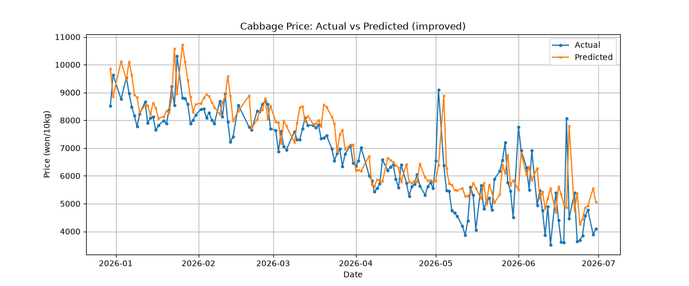
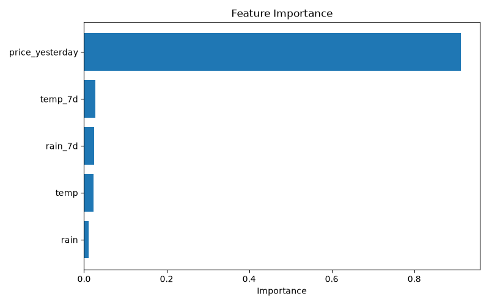

# 배추 가격 예측 프로젝트 🥬

기상 데이터(기온·강수량)를 활용해 배추 도매가격을 예측하는 머신러닝 프로젝트입니다.

## 프로젝트 개요

배추는 날씨에 민감해 가격 변동이 큰 작물입니다.
과거 기상 데이터와 가격 데이터를 학습시켜 날씨 조건에 따른 배추 가격을 예측하는 모델을 만들었습니다.

## 사용 데이터

- **배추 가격**: KAMIS 농산물유통정보 (가락시장 도매가격, 2024.01 ~ 2026.06)
- **기상 데이터**: 기상청 기상자료개방포털 (대관령 지점, 일별 기온·강수량)
- 두 데이터를 날짜 기준으로 병합 (총 751일치)

## 데이터 구성 (cabbage_weather.csv)

| 컬럼 | 설명 |
|------|------|
| date | 날짜 |
| price | 배추 도매가격 (원/10kg, 등급 평균) |
| temp | 평균기온 (°C) |
| rain | 일강수량 (mm) |

## 접근 방법

### 1차 시도 — 당일 날씨만 사용
- 입력: 당일 기온, 강수량 / 모델: 선형회귀
- 결과: **MAE 3481원** — 가격 변동을 거의 예측하지 못함
- 원인 분석: 당일 날씨만으로는 정보 부족. 배추 가격은 과거 날씨의 누적 영향과 전일 가격에 크게 좌우됨

### 2차 시도 — 변수 추가 + 모델 변경
- 추가 변수: 전일 가격, 최근 7일 평균 기온·강수량
- 모델: RandomForest
- 결과: **MAE 731원** — 실제 가격 변동을 잘 따라감

## 결과

당일 날씨만 사용했을 때보다 전일 가격과 누적 날씨 변수를 추가하자 예측 오차가 3481원에서 731원으로 크게 감소했습니다.

### 변수 중요도

| 변수 | 중요도 |
|------|--------|
| 전일 가격 (price_yesterday) | 91.3% |
| 최근 7일 평균기온 (temp_7d) | 2.8% |
| 최근 7일 평균강수량 (rain_7d) | 2.5% |
| 당일 기온 (temp) | 2.3% |
| 당일 강수량 (rain) | 1.1% |

전일 가격이 예측에 압도적으로 중요한 변수로 나타났습니다. 이는 배추 가격이 당일 날씨보다 직전 가격 흐름에 크게 좌우된다는 것을 시사합니다. 날씨 변수 중에서는 당일 값보다 최근 7일 누적 평균이 더 큰 영향을 보였습니다.

## 기술 스택

- Python
- pandas (데이터 처리)
- scikit-learn (머신러닝 모델)
- matplotlib (시각화)

## 파일 구성

- `cabbage_weather.csv` — 전처리 완료된 데이터
- `model.py` — 예측 모델 코드
- `result.png` — 예측 결과 그래프